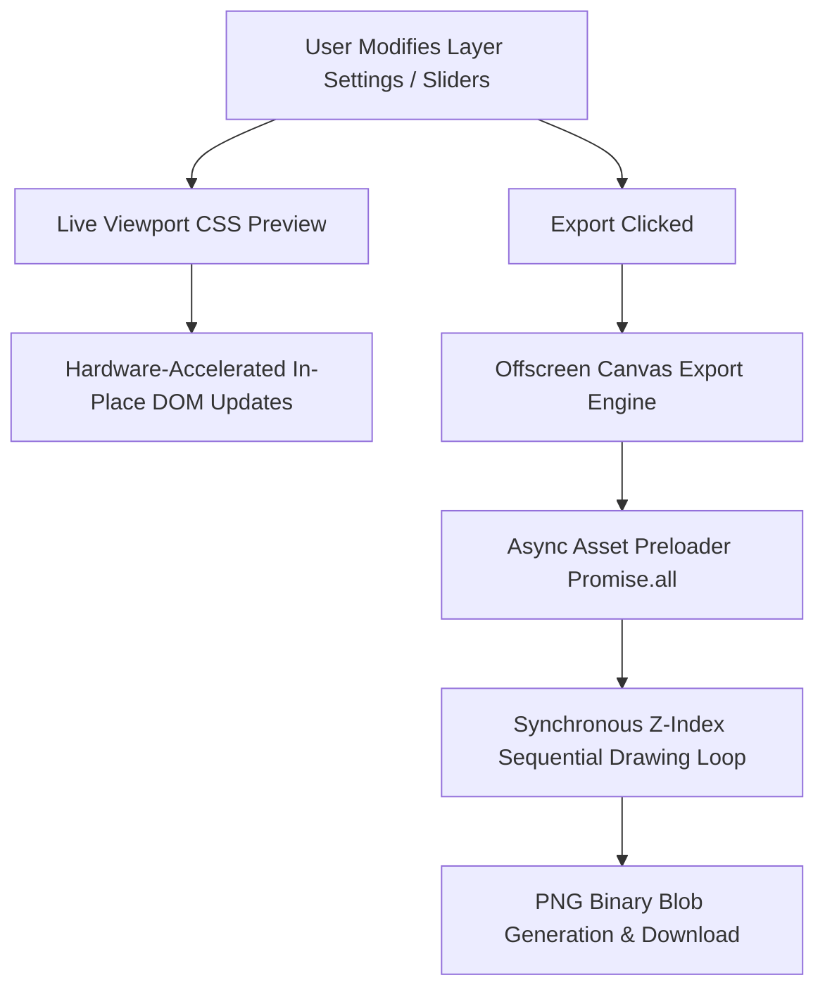

# System Architecture

This document describes the software architecture and implementation details of the Minimalist Dynamic Layer Image Editor.

---

## 1. Hybrid Rendering Pipeline

To balance smooth live UI performance and pixel-perfect high-resolution image generation, the application uses a **Hybrid Preview-to-Canvas Export** pipeline:



### live Viewport Rendering (Browser Compositor)
When dragging control sliders (e.g., opacity, translation coordinates, brightness, contrast, blur), updating the workspace must run at 60fps to prevent interface lag.
- **In-place Updates**: Rather than recreating the preview DOM element tree from scratch (which causes images to reload and generates memory thrashing), `updateUI()` performs an in-place diff. It matches existing HTML nodes by their unique `data-id` layer key, creates nodes for new layers, removes nodes for deleted layers, and re-appends nodes sequentially to maintain the correct Z-order stack.
- **Hardware Acceleration**: Transforms, opacity filters, and filter matrices are applied directly via inline CSS variables and styling coordinates. This offloads visual previews to the browser's hardware GPU compositor.

### Offscreen Canvas Export Engine (2D Context)
When downloading the final composition, the editor creates a hidden `<canvas>` matching the exact width and height dimensions of the selected layout preset (e.g., 1080x1350 for 4:5, 1920x1080 for 16:9).
- **Asynchronous Asset Pre-loading**: Drawing on a 2D canvas is a synchronous process. To draw image layers, we must wait for `HTMLImageElement` files to load. The export engine maps all layers to a `Promise.all` stack that pre-loads all images.
- **Deterministic Drawing Loop**: Once all image assets are ready, a synchronous `forEach` loop renders layers from bottom-to-top (the reverse of the layer state array), ensuring Z-index alignment and preventing layering races.
- **Transform Translations**: Layer coordinates are normalized as percentages (`-100%` to `100%`) and translated to absolute pixel bounds relative to the canvas origin.
- **Filter Mapping**: CSS filters are dynamically converted to scaled canvas filter configurations (`ctx.filter`) to keep physical blur radii and sizing proportions correct at high resolutions.

---

## 2. State Management

The application state is maintained in a single state container (`AppState`) conforming to the following static schemas:

```typescript
export interface LayerState {
  id: string;              // Unique RFC-4122 UUID v4 style string
  name: string;            // User-defined layer name
  type: 'image' | 'text';  // Layer type
  visible: boolean;        // Visibility toggle
  opacity: number;         // 0 to 100 opacity scale
  blendMode: string;       // CSS mix-blend-mode
  xOffset: number;         // Horizontal alignment offset (-100 to 100)
  yOffset: number;         // Vertical alignment offset (-100 to 100)
  scale: number;           // Sizing scale multiplier (0 to 500)
  blur: number;            // Gaussian blur radius in pixels (0 to 100)
  contrast: number;        // Image contrast percent (0 to 200)
  saturation: number;      // Saturation percent (0 to 200)
  brightness: number;      // Brightness percent (0 to 200)
  invert: boolean;         // Color inversion flag

  // Image-only attributes
  imageSrc?: string;       // Base64 Data URL of imported image
  imageName?: string;      // Filename reference

  // Text-only attributes
  textContent: string;     // Text string (supports newlines)
  fontFamily: string;      // Google font family selector
  fontSize: number;        // Font base size in pixels
  textColor: string;       // Text hex code color
}

export interface AppState {
  layers: LayerState[];              // Z-indexed stack of layers (first = top)
  activeLayerId: string | null;      // Currently selected layer UUID
  canvasWidth: number;               // Export width preset
  canvasHeight: number;              // Export height preset
  canvasRatio: string;               // Preset label (e.g. 1:1, 16:9, custom)
  canvasBgType: 'transparent' | 'white' | 'black' | 'custom';
  canvasBgColor: string;             // Custom background theme color
}
```

---

## 3. UI Synchronization & Event Architecture

* **Properties Syncing (`syncPropertiesPanel`)**: Synchronizes range, select, and text fields with the active layer's properties. It incorporates an active element focus check so that typing in active text inputs does not reset the cursor caret. When the user switches active layers, it overrides focus guards to load the new properties immediately.
* **Aspect Ratio Calculations**: Viewport aspect boundaries are adjusted dynamically in JS during orientation switches:
  * **Landscape / Square (`width >= height`)**: Sets viewport width to `100%` and height to `auto`.
  * **Portrait (`width < height`)**: Sets viewport width to `auto` and height to `100%`.
  This allows elements to fit snug within CSS flex parent columns without distorting bounds.
