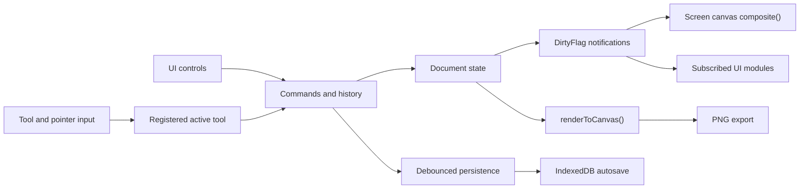

# Architecture

This guide describes the implemented Transparency editor. Treat the TypeScript source as the final authority when changing the model, rendering, history, tools, or persistence behavior.

## System Overview

Transparency is a browser-based TypeScript editor with one in-memory document, command-backed mutations, batched state notifications, and a shared Canvas 2D compositor. UI modules translate user intent into commands or tool actions; subscribers update only the affected editor surfaces.



The screen canvas and PNG export are not separate rendering implementations. Both pass the same `Doc` through `src/engine/compositor.ts`, which prevents preview/export drift.

## Document Model

`src/engine/document.ts` defines the complete serializable document shape plus the runtime canvas bitmap held by image layers. The central types currently read:

```typescript
export type BlendMode =
  'normal' | 'multiply' | 'screen' | 'overlay' | 'darken' | 'lighten';

export interface Effects {
  blur: number;
  blurOn: boolean;
  brightness: number;
  brightnessOn: boolean;
  contrast: number;
  contrastOn: boolean;
  saturation: number;
  saturationOn: boolean;
  invert: boolean;
}

export interface LayerTransform {
  x: number;
  y: number;
  scaleX: number;
  scaleY: number;
  rotation: number;
}

export interface LayerBase extends LayerTransform {
  id: string;
  name: string;
  visible: boolean;
  opacity: number;
  blendMode: BlendMode;
  effects: Effects;
}

export interface ImageLayer extends LayerBase {
  kind: 'image';
  bitmap: HTMLCanvasElement | null;
  bitmapRev: number;
  sourceName: string | null;
}

export interface TextLayer extends LayerBase {
  kind: 'text';
  text: string;
  fontFamily: string;
  fontSize: number;
  color: string;
}

export type Layer = ImageLayer | TextLayer;

export interface Doc {
  version: 2;
  width: number;
  height: number;
  bgType: 'transparent' | 'white' | 'black' | 'custom';
  bgColor: string;
  layers: Layer[];
  activeLayerId: string | null;
}
```

The layer array is also the visual stack: `layers[0]` is topmost. The compositor reverses the array while drawing so lower layers reach the canvas first, while hit testing walks it from index zero so the first visible hit is the frontmost layer.

Layer `x` and `y` are the layer center in document pixels, not viewport units. `scaleX` and `scaleY` are independent per-axis percentages, and `rotation` is degrees normalized to a single turn, so every layer carries a full affine placement. Effect blur and text `fontSize` are document pixels; font size is constrained to 8-512. Opacity is 0-100, and image contrast, saturation, and brightness use percent values when their corresponding effect switches are enabled.

## State and Notification Flow

`src/state.ts` owns the live `state.doc` reference and a small publish/subscribe layer. A `DirtyFlag` is one of five values:

- `structure`: layers were added, deleted, or reordered.
- `selection`: `activeLayerId` changed.
- `layerProps`: properties or effects changed on an existing layer.
- `canvasConfig`: document dimensions or background settings changed.
- `composite`: the screen canvas must be redrawn.

`notify()` adds flags to a pending set. The first call schedules `requestAnimationFrame`; later calls in the same frame only add flags. On the next frame, subscribers receive one deduplicated set. Listener failures are isolated so one panel cannot prevent other subscribers from refreshing.

Commands emit the narrowest relevant flags plus `composite`. For example, a layer property edit emits `layerProps` and `composite`, while a layer insertion emits `structure`, `selection`, and `composite`. Canvas rendering listens to every visual flag; panels subscribe only to the state categories they display.

## Commands and History

The `Command` interface in `src/engine/history.ts` supplies a label, `do()`, and `undo()`, with optional `coalesceKey` and byte estimate. Command factories in `src/engine/commands.ts` capture the previous values before returning reversible edits for document settings, layer fields, effects, insertion, deletion, and reordering.

History is bounded to 50 entries and 150 MiB. When either cap is exceeded, the oldest entries are trimmed, but the byte limit retains at least one command. Commands sharing a `coalesceKey` within 800 ms replace the latest command while preserving the original undo operation, so a slider gesture behaves as one history step.

Pushing after an undo truncates the redo tail. The history cursor identifies the last applied command; `jump()` repeatedly calls undo or redo to navigate directly to a selected row in the History panel. A separate saved cursor is updated by save and load operations. `isDirty()` compares that cursor with the current cursor, including the unreachable state that can result when trimming or redo-tail truncation removes the saved point.

## Tool System and Pointer Routing

`src/engine/tools.ts` defines `Tool`, `ToolOption`, registration, active-tool selection, and layer hit testing. Startup in `src/main.ts` registers the Move, Hand, Zoom, and Crop tools before the toolbar and canvas are initialized. The grouped toolbar renders live tools and grayed future slots from declarative group data, and the contextual options bar renders the active tool's option descriptors. Keyboard shortcuts select registered tools; holding Space temporarily activates Hand and restores the previous tool on release.

`src/canvas.ts` owns pointer capture and routes pointer down, move, up, and cancel events to the active tool. Every routed event first passes through `screenToDoc()`, which maps the canvas bounding rectangle into the document width and height. Tool implementations therefore receive stable document pixels regardless of CSS fitting, zoom, pan, or device pixel ratio.

## Editing Sessions, Snapping, and Crop

Interactive edits run inside session modules so previews stay live while history receives exactly one reversible command per confirmed edit.

- `src/engine/transform-session.ts` owns Move-tool drags and the explicit Free Transform session. A session snapshots the starting `LayerTransform`, previews handle gestures against the live layer, and on apply pushes a single transform command built from the start and end values. Cancel restores the snapshot without touching history.
- `src/engine/snap-engine.ts` is pure geometry. At gesture start the session caches snap candidates (document center, document edges, then visible-layer edges and centers). `snapTranslation()` converts a fixed screen-pixel radius through the overlay scale, resolves ties deterministically, and returns the corrected position plus alignment and measurement guide descriptors that `src/canvas-overlay.ts` draws at constant screen size. Holding Ctrl/Cmd bypasses snapping for the duration of the gesture.
- `src/engine/crop-session.ts` implements the non-destructive crop workflow behind the Crop tool. The session tracks a rect constrained to the document, aspect-ratio presets plus a validated custom ratio, and handle gestures. Apply rounds the rect, subtracts its origin from every layer center, and pushes one crop command that resizes the document; undo restores the previous geometry exactly because layer bitmaps and transforms are never resampled.

- `src/engine/stroke-session.ts` owns Brush, Pencil, and Eraser strokes. Pointer points map from document space into the target bitmap through the layer's inverse affine (`documentToBitmap`), and stamps accumulate on a session-owned canvas so a stroke keeps uniform opacity instead of compounding where it overlaps itself. On release the session composites that canvas into the layer bitmap once — `source-over` for paint, `destination-out` for the eraser — and pushes one command holding only the stroke's dirty rectangle, so undo cost tracks the painted area rather than the whole bitmap. Painting on an image layer with no pixels allocates a document-sized bitmap first and bundles that allocation into the same command.

## Compositor and Export Parity

`composite()` in `src/engine/compositor.ts` clears the target context, paints the configured background, and draws visible layers from bottom to top. It applies opacity, mapped blend mode, effect filters, center translation, and scale before drawing either an image bitmap or centered multiline text.

The interactive canvas in `src/canvas.ts` calls `composite()` with `overlay: true`, adding the editing overlays at constant screen weight: the active-layer transform outline and handles, smart alignment and measurement guides, and the crop shading with its rule-of-thirds grid. `renderToCanvas()` creates a document-sized offscreen canvas and calls the same `composite()` without overlay options. PNG export in `src/export.ts` therefore matches the document rendering but omits the selection overlay. The resulting PNG blob is downloaded through a temporary object URL that is revoked after use.

## Persistence and Autosave

Project downloads use the `.mledit.json` suffix and a versioned envelope with `app: 'minimalist-editor'`, `version: 2`, and `doc`. Loading validates the application marker, rejects newer envelope versions, reconstructs image canvases, clears history, marks the loaded cursor as saved, and notifies the affected UI. Version 1 projects still open: the loader migrates each legacy uniform `scale` into `scaleX`/`scaleY` with zero rotation and saves the result as version 2.

Image-layer canvases are PNG-encoded image data URLs inside the JSON envelope; text layers remain ordinary JSON data. Saving creates a JSON blob and temporary object URL, clicks a transient download link, then revokes the URL. This keeps existing `.mledit.json` envelope compatibility while allowing runtime image layers to use `HTMLCanvasElement`.

Autosave uses IndexedDB database `mledit`, object store `autosave`, and key `latest`. Each history change restarts a two-second debounce. When the timer fires, serialization and storage are appended to a shared promise, forming a serialized autosave chain that prevents writes from overtaking one another. At startup, a stored session produces a restore offer; accepting it deserializes the document, resets history, marks the restored state saved, and refreshes document-facing UI. IndexedDB failure is non-fatal and the unavailable warning is shown only once per session.

## UI Module Boundaries

| Module | Responsibility |
| --- | --- |
| `src/main.ts` | Registers tools, wires keyboard behavior, initializes UI modules, seeds the initial document, and starts restore/autosave. |
| `src/state.ts` | Owns `state.doc`, active-layer access, dirty categories, and batched notifications. |
| `src/engine/document.ts` | Defines document and layer types, factories, effects, measurements, and bounds. |
| `src/engine/commands.ts` | Builds reversible document and layer mutations with precise notifications. |
| `src/engine/history.ts` | Executes commands and manages undo, redo, coalescing, caps, saved state, and jump navigation. |
| `src/engine/tools.ts` | Defines the tool contract, registry, active selection, options, and front-to-back hit testing. |
| `src/canvas.ts` | Manages screen-canvas sizing, render requests, view transforms, pointer conversion, and routing. |
| `src/engine/compositor.ts` | Draws backgrounds, layers, effects, blend modes, and the optional selection outline. |
| `src/engine/persistence.ts` | Serializes project envelopes, opens project files, and implements IndexedDB autosave/restore. |
| `src/topbar.ts` | Connects project open/save and document-size presets or custom dimensions. |
| `src/options-bar.ts` | Renders contextual controls from the active tool's option descriptors. |
| `src/rail.ts` | Renders registered tools and toggles inspector panels. |
| `src/layers-panel.ts` | Creates, imports, selects, reorders, renames, hides, and deletes layers through commands. |
| `src/properties-panel.ts` | Synchronizes selected-layer controls and pushes property/effect commands. |
| `src/history-panel.ts` | Renders history state, switches the Layers/History view, and invokes jump navigation. |
| `src/export.ts` | Converts the shared compositor output into the downloadable PNG. |

## Performance Characteristics

State fan-out is frame-batched, so a burst of notifications produces one subscriber pass per animation frame. The screen context is capped at a device pixel ratio of 2, while the coordinate conversion and selection-outline calculation account for fitted canvas size. The compositor draws only visible layers and uses the layer bitmap already held in memory.

History limits bound the command stack by both count and estimated memory. Coalescing reduces high-frequency control gestures to one reversible action. Autosaves are delayed by two seconds and serialized, avoiding concurrent document encodes or out-of-order IndexedDB writes.

## Extending the Editor Safely

When adding a layer field, update its document type and defaults, command capture/apply behavior, compositor behavior if visual, persistence assumptions, property UI, and dirty flags as one change. Preserve the image/text discriminated union rather than adding optional fields to every layer.

New state-changing UI should push a reversible command instead of mutating `state.doc` directly. Select a stable `coalesceKey` only for repeated edits that belong to one gesture, and estimate bytes for commands retaining large pixel data. New tools should implement `Tool`, register during startup, consume `DocPoint` values, and keep view-only pan or zoom state outside `Doc`.

Any visual feature must be implemented through the shared compositor so screen and export stay aligned. Keep the export call free of overlay options. For persistence changes, retain version checks, provide an explicit compatibility path before incrementing the envelope version, and verify project save/open, autosave ordering, restore, and object URL cleanup.
